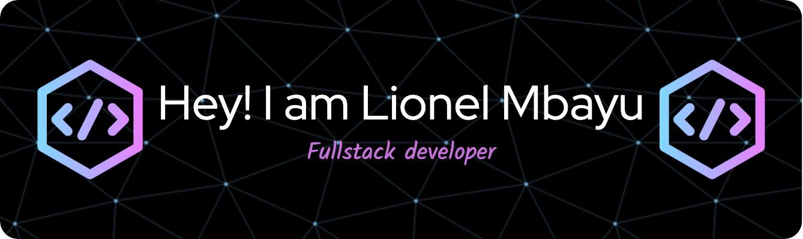

<h2 align="center"> I'm a tinkerer at heart and have finally found an outlet as a Full-Stack Developer. </h2>
</img>

  

- 🌱 I’m currently learning **Building Restful API's and Adding Data Persistence**

- 💬 Ask me about **React.Js and anything JavaScript**

- 📫 How to reach me **Lionel.mbayu@gmail.com**

- 📄 Know about my experiences [https://www.linkedin.com/in/lionel-mbayu/](https://www.linkedin.com/in/lionel-mbayu/)

- ⚡ Fun fact **I am fluent in 2 languages. Running is my happy space.**

<h3 align="left">Connect with me:</h3>

<h3 align="left">Languages and Tools:</h3>

                

&nbsp;

